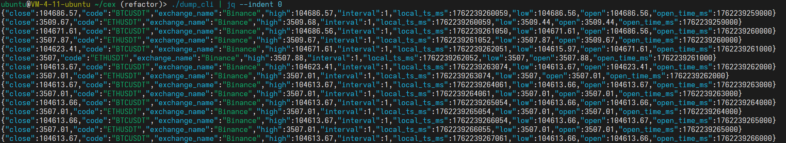

# CEX

这是一个用于处理集中式交易所 (CEX) 数据读写与导出的轻量级工具集，包含若干 Rust crate：用于共享内存通道通信的核心库 (`cex-core`)，以及若干演示/工具二进制程序（例如 `dump_cli`、`binance`、`okx`）。

本文档用中文简要说明仓库目的、各子模块的作用、如何构建与运行，以及一些常见注意事项（例如日志与管道/jq 的交互）。

## 仓库概览

顶层主要目录/文件：

- `cex-core/`：核心库，包含共享内存通道（reader/writer）以及数据结构定义（例如 Kline）。其他二进制和测试都依赖它。
- `dump/`：导出工具（package 名称：`dump_cli`），可以把共享内存通道的数据导出为 JSON/CSV/Parquet。常用于将数据通过管道传给 `jq` 等工具或保存为文件。
- `binance/`：币安数据源，示例或演示程序，展示如何用 `cex-core` 读取/写入数据。
- `okx/`：欧意数据源，另一个演示/程序（同上）。


## 设计目的

该仓库的目标是：

- 为下游提供简单易用且高性能的数据源接口。
- 提供 dump_cli 导出共享内存，以及持久化为常用格式（JSON/CSV/Parquet）

## 快速开始 — 构建与运行

1. 在仓库根构建所有 crate

```shell
cargo build
```

2. 运行 `dump_cli` 并把输出传给 `jq` 并进行过滤等处理


```shell
# 直接运行
dump_cli | jq
```
### 将导出写入文件

若要把结果写为 Parquet 文件：

```shell
dump_cli -f parquet -o /path/to/out.parquet
```

（注：Parquet 格式需要指定 `--output`，且 dump 会把一段缓冲写入 Parquet 文件）

## crate 说明

- `cex-core`
	- 功能：提供共享内存通道（Reader/Writer）、数据结构（例如 `CPTKline`）、辅助方法（如 `read_fixed`）等。
	- 用法：作为库依赖在其它 crate 中使用。
    - - Read: `Receiver::<T>::open_with_mode(...)`，然后循环 `next()` 获取数据。
    - - Write: `create_channel::<CPTKline>(CH_KLINE_V1, CHANNEL_CAP)`

- `dump` (`dump_cli`)
		- `--output` / `-o`：输出文件路径（若不指定并使用 json/csv，则输出到 stdout）
	- 日志：使用 `tracing`/`tracing-subscriber`，默认配置会把日志写到 stderr（避免污染 stdout）。

- `binance` / `okx`
	- 功能：演示/工具程序，用于展示如何生成/消费 `cex-core` 中定义的数据。


